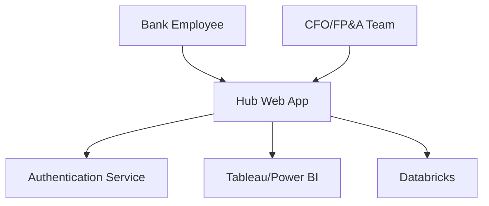
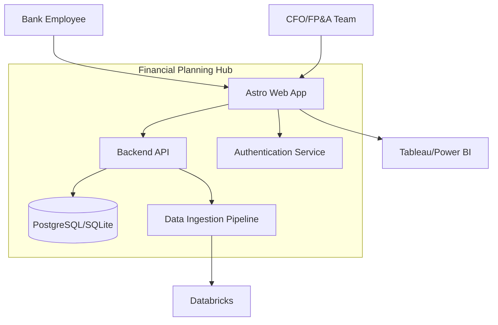
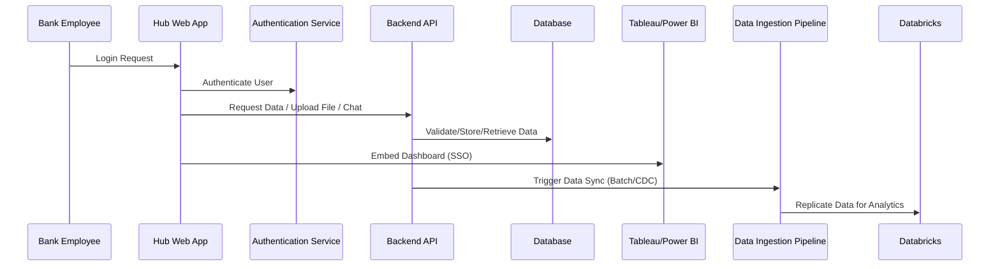

# Project Architecture

## Overview

This project is an internal hub for the financial planning/CFO team of a bank. It centralizes access to data visualizations, provides a modular interface for various financial tools, and manages data collection and validation from multiple departments. The hub is designed as a multi-page application (MPA) with a unified visual identity, allowing each "mini app" to be self-contained yet tightly integrated.

## Architecture Diagrams

### System Context

<!-- For external viewers: [System Context Diagram Image](./docs/diagram-system-context.png) -->

### Container Diagram

<!-- For external viewers: [Container Diagram Image](./docs/diagram-container.png) -->

### Key Data & Flow Diagram

<!-- For external viewers: [Key Data & Flow Diagram Image](./docs/diagram-sequence.png) -->

## Design Guidelines

- **Frontend**
  - Use Astro as the main framework for performance and modern web standards.
  - Use React for interactive components where needed.
  - TypeScript is required for type safety and maintainability.
  - Data visualizations are embedded as external pages (Tableau/Power BI) within the app.
  - Modular, self-contained routes/components for each mini app.
- **Backend**
  - Node.js as the runtime environment for backend services.
  - Hono as the lightweight, fast backend framework for REST APIs.
- **Database & Data Ingestion**
  - PostgreSQL as the main relational database for structured data and logs.
  - SQLite as an optional lightweight database for local or small-scale deployments.
  - Databricks as the data warehouse for analytics; PostgreSQL data is replicated here for advanced analysis.
  - Data from PostgreSQL is replicated to Databricks via scheduled batch jobs (batch pipeline) or near-real-time ingestion (CDC) for critical data sync.
- **Infra & Security**
  - Use GitHub Actions for CI/CD automation.
  - Authentication (OAuth, SSO) for user management.
  - Role-Based Access Control (RBAC/ABAC) to ensure users only access permitted resources.
  - Input validation and logging for all user inputs and file uploads.
- **General**
  - Organize code by feature or domain, not by class.
  - Keep UI, business logic, and data access separate.
  - Prefer pure/stateless functions and composition.
  - Use clear, predictable data flow (unidirectional for frontend state).
  - Consistent naming, normalization, primary/foreign keys, indexing, and documentation for database models.
  - Use migration tools and secure credentials.
  - Keep documentation up to date with code and architecture changes.

## Implementation Plan

1. Set up project structure (Astro frontend, Node.js/Hono backend, database).
2. Build authentication (RBAC/ABAC at the hub entry point, SSO integration).
3. Implement main features:
    - Home page with links to embedded Tableau/Power BI dashboards.
    - Modular "mini apps" (e.g., Chat, Excel Upload) as self-contained routes/components.
    - Backend API for business logic, file validation, and data access.
    - Data ingestion pipeline for replication to Databricks (batch and CDC).
    - Admin views for monitoring and consolidated data.
4. Apply database and data modeling best practices:
    - Consistent naming, normalization, primary/foreign keys, indexing, documentation.
    - Use migration tools and secure credentials.
5. Testing & QA:
    - Unit and integration tests for all modules.
    - User acceptance testing with sample data.
6. Documentation:
    - Keep architecture and implementation docs up to date.
    - Document API endpoints and data flows.
